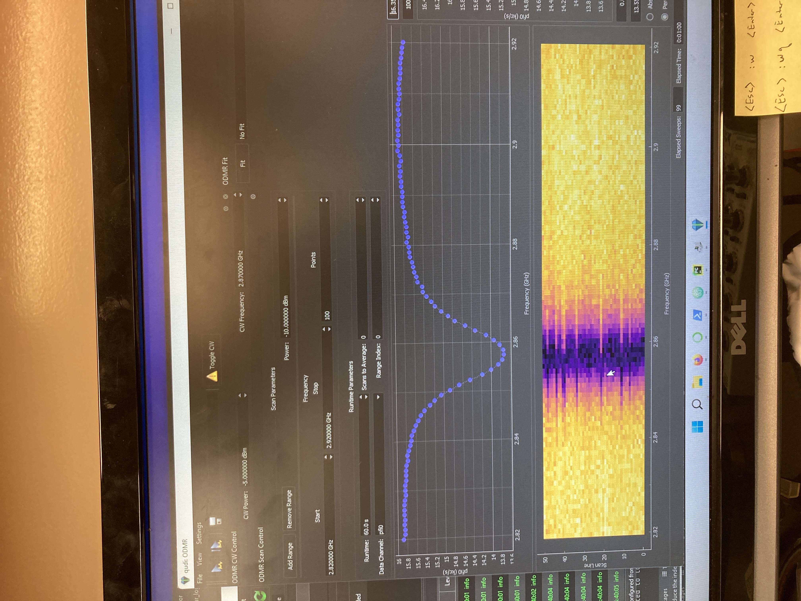
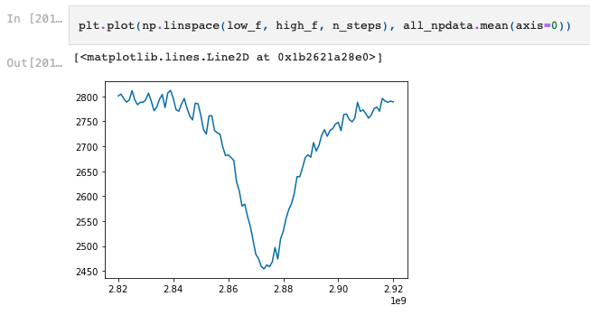
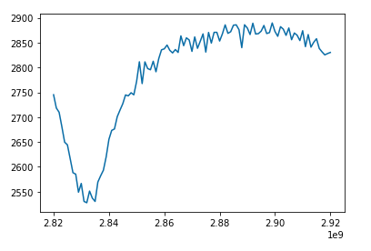
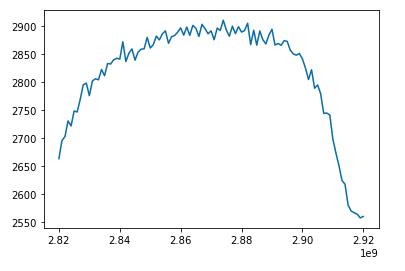
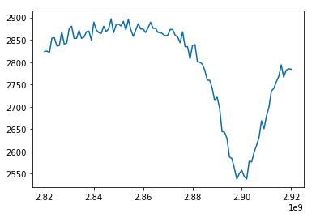
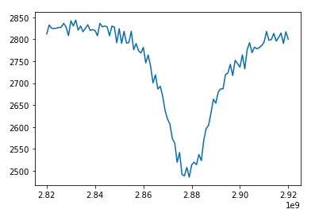

# Introduction

# G. Adam Cox

* 2008
  * Ph.D. @ UW - neutrino physics (Sudbury Neutrion Observatory)
* 2008-2013
  * postdocs - dark matter detection (EDELWEISS - France/Germany)
  * teaching
* 2013 - industry (Seattle)
  * data science
* Summer 2022 -- Sabbatical

<br><br><br>
<br><br><br>

# Primary Goal
#### General Purpose Community Microscope
#### Easily Maintainable

<br><br>

### Near Term Goals
* CW ODMR
* Pulsed ODMR
* Rabi
* Hahn-Echo


<br><br><br>
<br><br><br>


# Qudi Software

* Developed by Inst. for Quantum Optics @ Ulm University
* General Purpose to support many different hardware
* Configuration Files to define specific setup
* Extensible
* Python
* GUI


<br><br><br>
<br><br><br>

# CW ODMR with Qudi




<br><br><br>
<br><br><br>

# CW DIY

[Jupyter Notebook Code](../cwodmr/my_cw_odmr_v1.ipynb)




<br><br><br>
<br><br><br>

# No Clock

* No clock to synchronize hardware

### Demonstration

#### 0.20 seconds

```python
clock_task, data_task, data_reader = configure_tasks()

rf_generator._write('g1')    #starts MW scan from beginning
time.sleep(0.20) # add artificial delay -- expect to shift location of MR frequency in the data

clock_task.start()
data_task.start()

read_samples = data_reader.read_many_sample_double(data_buffer, number_of_samples_per_channel=n_steps, timeout=read_write_timeout)

```



#### 0.30 seconds

```python
time.sleep(0.30) # add artificial delay -- expect to shift location of MR frequency in the data
```




#### 0.40 seconds

```python
time.sleep(0.40) # add artificial delay -- expect to shift location of MR frequency in the data
```




#### 0.50 seconds

```python
time.sleep(0.50) # add artificial delay -- expect to shift location of MR frequency in the data
```




* Adding hardware clock / trigger is immediate next step.
  * trigger start of RF scan to synchronize with start of acquisition
  * more reading of NI/Windfreak documentation


<br><br><br>
<br><br><br>


# Qudi v. DIY

What's the best route to take?

* DIY software should be relatively simple
  * based on `nidaqmx`
* Can use various visualization tools available in python with simple code base
* Qudi code organization / design patterns
  * feels difficult to extend (GUI code and logic/hardware code not separated enough)
  * may be more difficult for future QT3 students/users to maintain
* Qudi documentation is not fully developed
* main developer (former PhD student) has now moved on
  * uncertain future
* to use Qudi, we would **still** need to write software for our hardware that fits into Qudi


Uncertain which direction to recommend, but in the near-term, DIY won't be a wasted effort
because would need to write that software anyways to go into Qudi.

Perhaps Qudi will make more since after DIY attempt.
